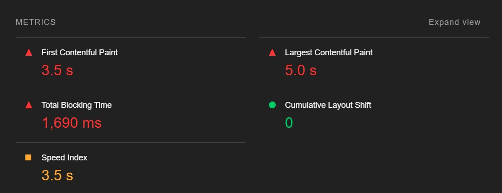
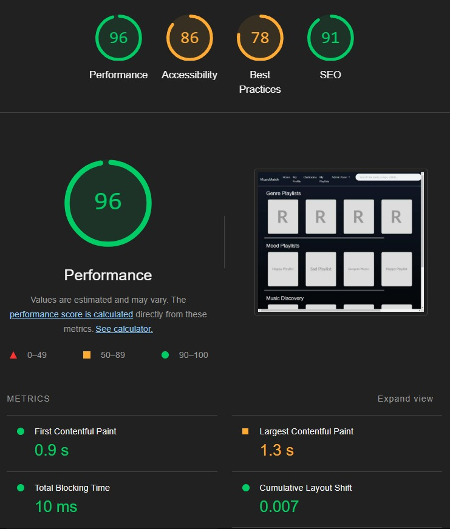

# Performance Optimizations

To enhance our application's performance and improve the Lighthouse score from 47 to 96, we implemented several key optimizations focusing on resource loading and caching:

## Bundle and Minification Implementation

We implemented bundling and minification for our static resources using WebOptimizer. This significantly reduced the number of HTTP requests needed to load our application by combining multiple CSS and JavaScript files into single bundles:

```csharp
builder.Services.AddWebOptimizer(pipeline => {
    pipeline.AddCssBundle("/css/bundle.css", 
        "css/site.css",
        "css/events.css",
        "css/chatroom.css",
        "css/artist.css",
        "css/eventDetails.css"
    );
});
```

## Caching Configuration
We configured aggressive caching for static files by implementing proper HTTP headers, setting a cache duration of 7 days to reduce server load and improve loading times:

```csharp
app.UseStaticFiles(new StaticFileOptions
{
    OnPrepareResponse = ctx =>
    {
        ctx.Context.Response.Headers.Append(
            "Cache-Control", "public,max-age=604800"
        );
    }
});
```

## Resource Loading Optimization
We optimized our resource loading by updating our asset references to use the bundled versions and enabling version hashing to ensure proper cache invalidation:

```csharp
<link rel="stylesheet" href="/css/bundle.css" asp-append-version="true" />
<script src="/js/bundle.js" asp-append-version="true"></script>
```


##Conclusion
These optimizations resulted in:

- Reduced number of HTTP requests
- Improved resource caching
- Faster First Contentful Paint (FCP)
- Better overall performance metrics

The implementation of these optimizations led to a significant improvement in our Lighthouse performance score, increasing it from 47 to 96, demonstrating substantial enhancement in the application's loading speed and overall performance.

# Before optimizations:




# What we achieved with the optimization

