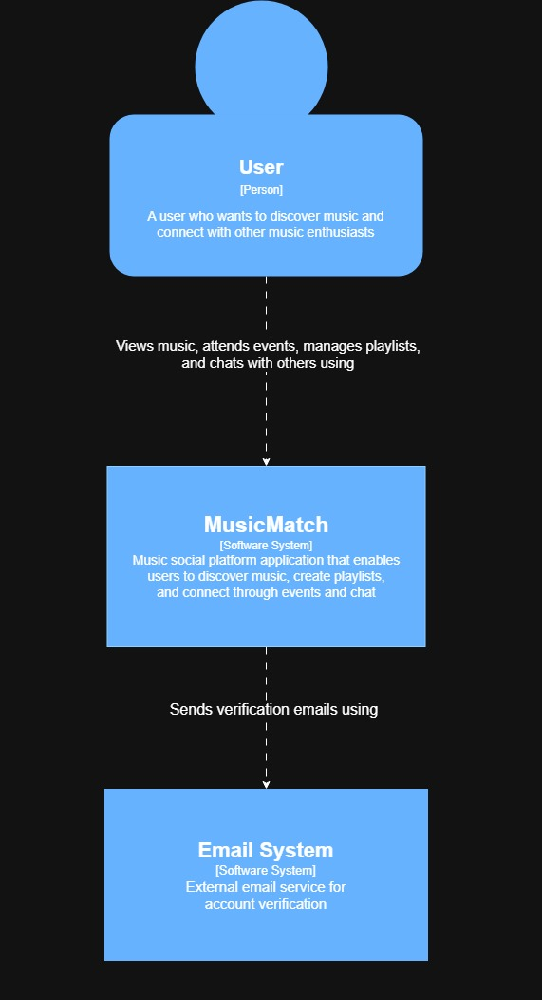
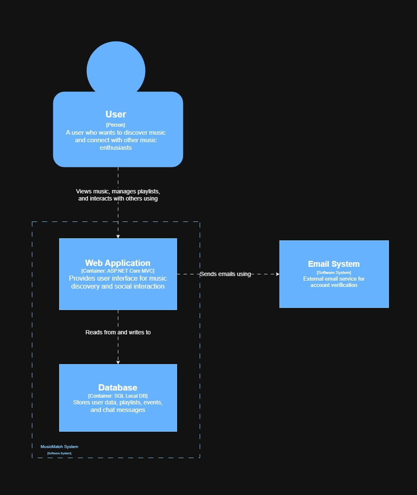

# 🚀 What we have improved...

## 1. Automated Testing Implementation with Selenium
We've enhanced our testing approach by also implementing Selenium E2E testing alongside our existing testing methods. This addition provides automated verification of critical user flows and admin functionalities.

***Please note that the Email Verification system was temporarily disabled just so that we were able to run the tests without exiting our application!***

You can view our live testing results [here](https://drive.google.com/drive/folders/1vgYiiV-F5lZbO9EMn_nejsJKz43GUrdB?usp=drive_link) or check out our full documentation on the Selenium testing we performed [here](./SeleniumTesting.md).

### Key Features
- Automated testing of core user journeys
- Real-time validation of admin workflows
- Timestamp-based unique user creation for reliable testing

### Test Coverage
- User Registration Flow
- Admin Genre Creation
- Admin Artist Creation

## 2. Performance Optimization
After analyzing our Lighthouse report, we implemented several optimizations that improved our performance score from 47 to 96🥳:

See how we achieved this reading our [Performance Optimization doc](./Performance-Optimization.md).

### Key Improvements
- Implemented bundling and minification using WebOptimizer
- Configured aggressive caching for static files
- Reduced HTTP requests through asset bundling

These changes resulted in:
- Faster First Contentful Paint (FCP)
- Improved resource caching
- Better overall performance metrics

## 3. Comprehensive Functional Testing Plan
We've developed and implemented a detailed functional testing plan ([check it out!](./Functional-Testing-Plan.pdf)) that covers:

### Test Categories
- User Account Management
- Artist Management
- Event Management
- Genre Management
- Song Management

Each test case includes:
- Specific test steps
- Expected results with timing constraints
- Pre-verification processes
- Success criteria

## 4. Enhanced Non-Functional Requirements Documentation
We've documented better our non-functional requirements and the solutions we offered:

You can see our doc [here](./Non-functional_Requirements&Solutions.pdf).

### Key Areas
- **Responsiveness**: 2-second response time for searches, 1-second for real-time features
- **Reliability**: 100% data consistency for playlists, 99% accuracy in friend suggestions
- **Availability**: 99% uptime, instant chatroom availability
- **Security**: Protected private content, SQL injection prevention
- **Usability**: 3-step playlist creation, 2-click navigation
- **Maintainability**: 30-second recovery time, 99.9% update consistency

These improvements have significantly enhanced our application's reliability, performance, and user experience while establishing a robust foundation for future development and testing.

## 5. Improved Diagrams

### System Diagram

### Container Diagram 

