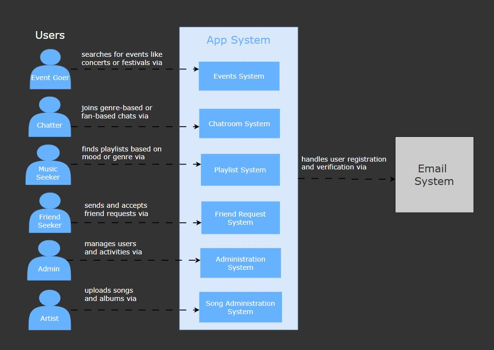
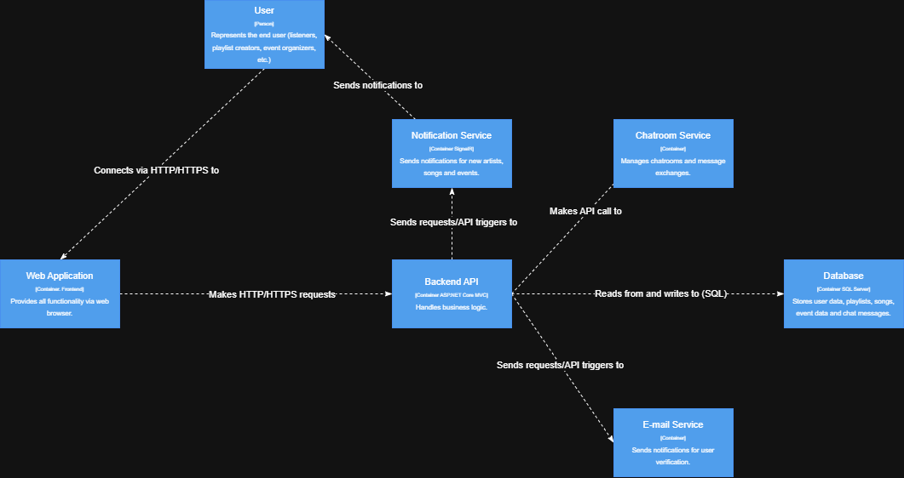
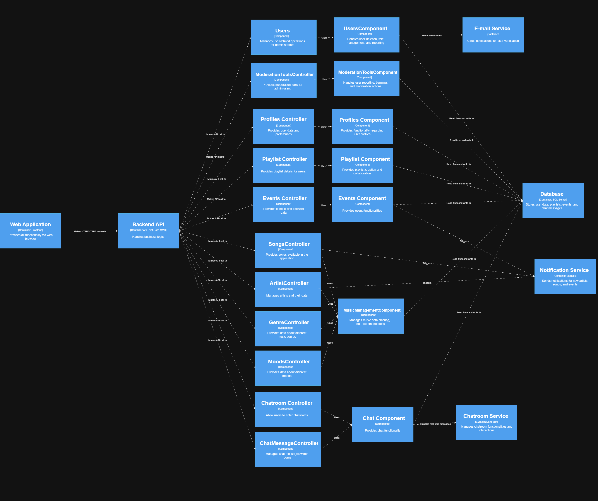

# C4 Model Documentation for MusicMatch

## Overview
This document presents the architectural views of MusicMatch using the C4 model methodology. The C4 model provides a hierarchical way of thinking about software architecture using different levels of abstraction: System, Containers, Components.

## System Context Diagram
The System Context diagram shows MusicMatch and how it fits into the world around it.

### Key Elements

**Users**:
-  **Event Goer**: Searches for events like concerts or festivals
-  **Chatter**: Joins genre-based or fan-based chats
-  **Music Seeker**: Finds playlists based on mood or genre
-  **Friend Seeker**: Sends and accepts friend requests
-  **Admin**: Manages users and activities
-  **Artist**: Uploads songs and albums

### App System Components:

- **Events System**
- **Chatroom System**
- **Playlist System**
- **Friend Request System**
- **Administration System**
- **Song Administration System**

### External Systems:

- **Email System**: Handles user registration and verification

### Key Relationships

- Each user type interacts with their specific system component
- App System communicates with Email System for user management
- Each subsystem provides specialized functionality for different user types

## Container Diagram
The Container diagram shows the high-level technical building blocks of the MusicMatch system.

### Key Containers
- **User**: Represents the end user (listeners, playlist creators, artists, event goers, etc.)
- **Web Application**: Provides all functionality via web browser
- **Backend API**: Built with ASP.NET Core MVC, handles business logic
- **Database**: SQL Server database that stores user data, playlists, songs, event data and chat messages
- **Notification Service**: Sends notifications for new artists, songs and events
- **Chatroom Service**: Manages chatrooms and message exchanges
- **E-mail Service**: Used for user account verification

### Key Relationships
- User connects via HTTP/HTTPS to the Web Application
- Web Application makes HTTP/HTTPS requests to Backend API
- Backend API reads from and writes to Database
- Backend API sends requests/API triggers to Notification Service, Chatroom Service, and E-mail Service

## Component Diagram
The Component diagram shows the main components within our container.

### Key Components
- **Users Component**: Manages users and implements moderation for administrators
- **Moderation Tools Component**: Handles moderation functionalities and moderation actions
- **Profiles Component**: Provides functionality regarding user profiles
- **Playlist Component**: Provides playlist creation and collaboration
- **Events Component**: Provides event functionalities
- **Songs Controller**: Provides songs available in the application
- **Artist Controller**: Manages artists and their data
- **Genre Controller**: Provides data about different music genres
- **Moods Controller**: Provides data about different moods
- **Chatroom Controller**: Allows users to send messages
- **Chat Message Controller**: Manages chat messages within rooms
- **Music Management Component**: Manages playlists, songs, albums, and recommend systems

### Key Relationships
- All controllers make API calls to their respective components
- Components interact with the Database for data storage and retrieval
- Notification Service is triggered by various components for user notifications
- Chat Component enables real-time messaging through the Chatroom Service

## Technology Stack
- **Frontend**: ASP.NET Core MVC
- **Backend**: ASP.NET Core Web API
- **Database**: SQL Server
- **Real-time Communication**: SignalR
- **Authentication**: Identity-based authentication

  
## Future Considerations
1. **Scalability Improvements**
   - Implementation of caching layers
   - Database sharding for better performance
   - Load balancing strategies

2. **Additional Features**
   - Integration with more music streaming services
   - Enhanced recommendation algorithms
   - Advanced social features

3. **Technical Debt**
   - Continuous monitoring and improvement of system architecture
   - Regular updates of dependencies
   - Performance optimization

## Conclusion
This C4 model documentation provides a comprehensive view of the MusicMatch system architecture, from high-level context to detailed components. It serves as a guide for development teams and stakeholders to understand the system's structure and design decisions.
